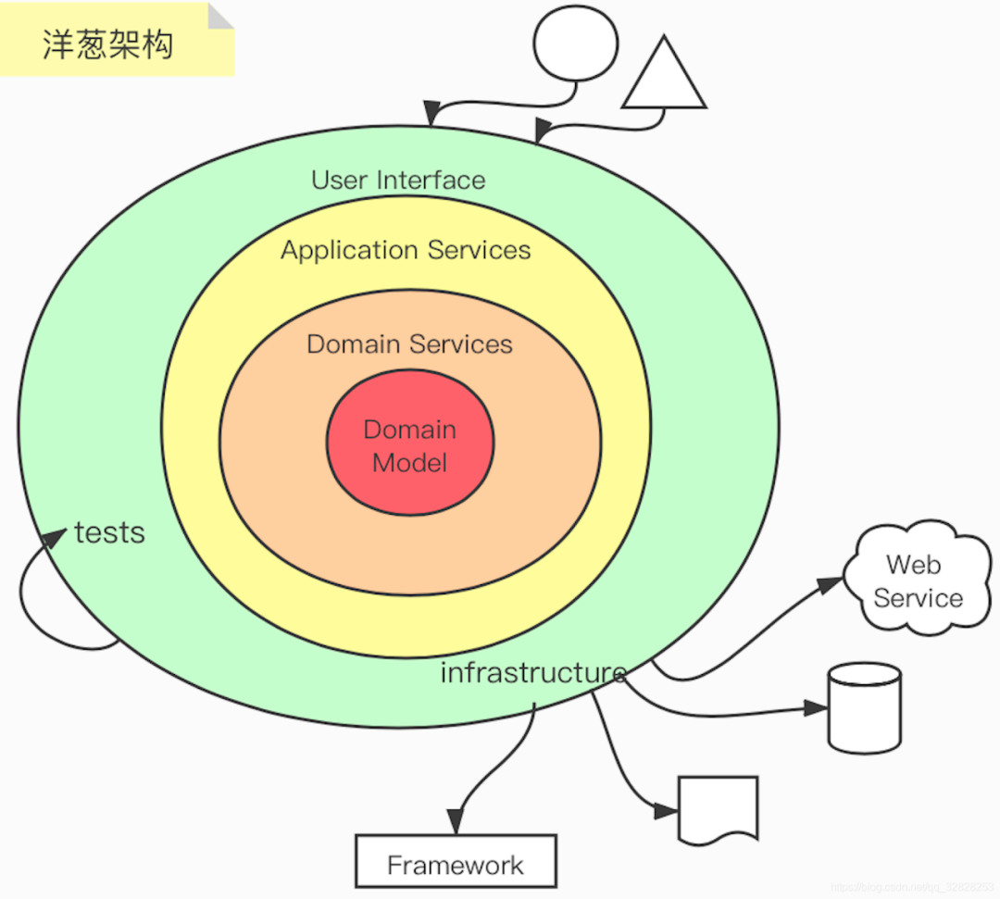

# 领域驱动设计(Domain Driver Design)
# 领域驱动设计 


## 领域驱动设计架构图

解决复杂软件应对业务变化的设计之道 , 以贴近现实自然世界的运转方式来处理架构问题





## 重要概念


### 模型驱动设计

模型驱动设计是领域驱动设计的核心， 而模型驱动设计的核心是**领域模型**， 领域模型必须在**统一语言**指导下才能完成。

领域模型要么属于要么属于核心子域，要么数据通用子域。

为什么区分子域？
 - 将一个不容易解决的问题分而治之
 - 为了更好地实现人力资源的分配（一个子域一个团队）

为了保证定义的领域模型在不同上下文表达各自的知识语境， 需要引入限界上下文： 来确定业务能力的自治边界，并考虑通过持续集成来维护模型的统一。
上下文映射清晰地表达了多个限界上下文之间的协作关系。根据协作方式的不同，可以将上下文映射分为八种模式见：上下文映射图

```text
概念思维导图

领域驱动设计 —— 模型驱动设计 —— 统一语言 —— 核心通用域 —— 限界上下文 —— 上下文映射

```

### 领域
一串紧密结合的业务逻辑 ，现实世界中，领域包含了问题域和解系统。一般认为软件是对现实世界的部分模拟。在DDD中，解系统可以映射为一个个限界上下文，限界上下文就是软件对于问题域的一个特定的、有限的解决方案。

### 实体
当一个对象由其标识（而不是属性）区分时，这种对象称为实体（Entity）。

例：最简单的，公安系统的身份信息录入，对于人的模拟，即认为是实体，因为每个人是独一无二的，且其具有唯一标识（如公安系统分发的身份证号码）。
 - 具有完整的生命周期
 - 具有状态
 - 具有唯一标识符

### 值对象
当一个对象用于对事务进行描述而没有唯一标识时，它被称作值对象（Value Object）。

例：比如颜色信息，我们只需要知道{“name”:“黑色”，”css”:“#000000”}这样的值信息就能够满足要求了，这避免了我们对标识追踪带来的系统复杂性。

 - 没有生命周期
 - 没有状态
 - 客观存在的值类型，现实世界不能区分这个和那个
 - 没有唯一标识符

### 聚合

是一种边界，它可以封装一到多个实体与值对象，并维持该 边界范围之内的业务完整性。

聚合至少包含一个实体，且只有实体才能作为聚合根（aggregate root）。

 - 仅聚合根提供对外的访问接口，聚合内部如何复杂，外部无法感知道
 - 高内聚
 - 低耦合
 - 特殊地：读数据可以绕过开聚合根，因为读数据不改变实体的状态
 - 核心领域往往都需要用聚合来表达

如何创建好的聚合？

 - 边界内的内容具有一致性：在一个事务中只修改一个聚合实例。
 - 如果你发现边界内很难接受强一致，不管是出于性能或产品需求的考虑，应该考虑剥离出独立的聚合，采用最终一致的方式。
 - 设计小聚合：大部分的聚合都可以只包含根实体，而无需包含其他实体。即使一定要包含，可以考虑将其创建为值对象。
 - 通过唯一标识来引用其他聚合或实体：当存在对象之间的关联时，建议引用其唯一标识而非引用其整体对象。如果是外部上下文中的实体，引用其唯一标识或将需要的属性构造值对象。 如果聚合创建复杂，推荐使用工厂方法来屏蔽内部复杂的创建逻辑。

特别地：

聚合内部多个组成对象的关系可以用来指导数据库创建，但不可避免存在一定的抗阻。如聚合中存在List<值对象>，那么在数据库中建立1:N的关联需要将值对象单独建表，此时是有id的，建议不要将该id暴露到资源库外部，对外隐蔽。

### 聚合根

Aggregate(聚合）是一组相关对象的集合，作为一个整体被外界访问，聚合根（Aggregate Root）是这个聚合的根节点。

 - 一组聚合只有一个聚合根
 - 访问聚合内部的实体，必须通过聚合根进行访问


### 工厂
工厂和资源库负责管理聚合的生命周期。

工厂用于聚合的创建，用于封装复杂或者可能变化的创建逻辑；

可以用于屏蔽底层数据结构，构建更大、更丰富的聚合根，即将聚合根创建的复杂过程简化为**工厂**，多采用创建者模型

 采用创建型模式实现：
 - 工厂方法
 - 原型模式
 - 单例模式
 - 建造者模式
 - 抽象工厂方法

### 资源库
负责从存放资源的位置（数据库、内存或者其 他Web资源）获取、添加、删除或者修改聚合。

### 领域服务

一些重要的领域行为或操作，可以归类为领域服务。它既不是实体，也不是值对象的范畴

当我们采用了微服务架构风格，一切领域逻辑的对外暴露均需要通过领域服务来进行。如原本由聚合根暴露的业务逻辑也需要依托于领域服务。

### 领域事件

领域事件是对领域内发生的活动进行的建模。


### 限界上下文

一个由显示边界限定的特定职责。领域模型便存在于这个边界之内。

在边界内，每一个模型概念，包括它的属性和操作，都具有特殊的含义。

### 贫血模型

Anemic Domain Object 贫血领域对象

仅作为数据的载体，没有对应的行为和动作领域的对象

 - 实体的状态变化由外部控制
 - 变化暴露到外部，导致核心业务逻辑的变化导致代码修改，定位业务逻辑复杂

**贫血失忆症**：因无法管理自身状态，导致业务逻辑分散在多个其他的管理类中，实体自己无法记住、修改自身的状态

### 充血模型


### 领域划分思想

解决复杂和大规模软件的武器可以被粗略地归为三类：抽象、分治和知识。

- 分治 把问题空间分割为规模更小且易于处理的若干子问题。分割后的问题需要足够小，以便一个人单枪匹马就能够解决他们；其次，必须考虑如何将分割后的各个部分装配为整体。分割得越合理越易于理解，在装配成整体时，所需跟踪的细节也就越少。即更容易设计各部分的协作方式。评判什么是分治得好，即高内聚低耦合。
- 抽象 使用抽象能够精简问题空间，而且问题越小越容易理解。举个例子，从北京到上海出差，可以先理解为使用交通工具前往，但不需要一开始就想清楚到底是高铁还是飞机，以及乘坐他们需要注意什么。
- 知识 顾名思义，DDD可以认为是知识的一种。

**DDD的核心诉求就是将业务架构映射到系统架构上，在响应业务变化调整业务架构时，也随之变化系统架构。而微服务追求业务层面的复用，设计出来的系统架构和业务一致；在技术架构上则系统模块之间充分解耦，可以自由地选择合适的技术架构，去中心化地治理技术和数据。**


### 问题空间和解空间

哲学家常常会围绕真实世界和理念世界的映射关系探索人类生存的意义， 即所谓“两个世界” 的哲学思考。软件世界也可一分为二，分为构成描述需求问题的真实世界与获取解决方案的理念世 界。整个软件构建的过程，就是从真实世界映射到理念世界的过程。

如果真实世界是复杂的，在映射为理念世界的过程中，就会不断受到复杂度的干扰。根据Allen Newell和Herbert Simon的问题空间理论：“人类是通过在问题空间 （problem space） 中寻找解决方 案来解决问题的”[9]，构建软件（世界） 也就是从真实世界中的问题空间寻找解决方案，将其映射 为理念世界的解空间（solution space） 来满足问题空间的需求。因此，软件系统的构建实则是对问 题空间的求解，以获得构成解空间的设计方案，如图2-2所示。


为什么要在软件构建过程中引入问题空间和解空间？

实际上， 随着IT技术的发展， 软件系统正是在这两个方向不断发展和变化的。在问题空间， 我们要解决的问题越来越棘手，空间规模越来越大，因为随着软件技术的发展， 许多原本由人 来处理的线下流程慢慢被自动化操作所替代，人机交互的方式发生了翻天覆地的变化，IT化的 范围变得更加宽广，涉及的领域也越来越多。问题空间的难度与规模直接决定了软件系统的复 杂度。

针对软件系统提出的问题， 解决方案的推陈出新自然毋庸讳言， 无论是技术、工具，还是设 计思想与模式，都有了很大变化。解决方案不是从石头里蹦出来的，而必然是为了解决问题而生的。 面对错综复杂的问题，解决方案自然也需要灵活变化。软件开发技术的发展是伴随着复用性和扩展性发展的。倘若问题存在相似性，解决方案就有复用的可能。通过抽象寻找到不同问题的共性时， 相同的解决方案也可以运用到不同的问题中。同时，解决方案还需要响应问题的变化，能在变化发 生时以最小的修改成本满足需求，同时保障解决方案的新鲜度。无疑，构成解空间的解决方案不仅 要解决问题，还要控制软件系统的复杂度。

问题空间需要解空间来应对，解空间自然也不可脱离问题空间而单独存在。对于客户提出的 需求，要分清楚什么是问题，什么是解决方案，真正的需求才可能浮现出来。在看清了问题的真相 之后，我们才能有据可依地寻找真正能解决问题的解决方案。软件构建过程中的需求分析，实际就 是对问题空间的定位与探索。如果在问题空间还是一团迷雾的时候就贸然开始设计，带来的灾难性 结果是可想而知的。徐锋认为，“要做好软件需求工作，业务驱动需求思想是核心。传统的需求分 析是站在技术视角展开的， 关注的是‘方案级需求’；而业务驱动的需求思想则是站在用户视角展 开的，关注的是‘问题级需求’。”[10]2

怎么区分方案级需求和问题级需求？ 方案级需求就好比一个病人到医院看病， 不管病情就直 接让医生开阿司匹林， 而问题级需求则是向医生描述自己身体的症状。病情是医生要解决的问题， 处方是医生提供的解决方案。

那种站在技术视角展开的需求分析， 实际就是没有明确问题空间与解空间的界限。在针对问 题空间求解时，必须映射于问题空间定义的问题，如此才能遵循恰如其分的设计原则，在问题空间 的上下文约束下寻找合理的解决方案。

领域驱动设计为问题空间与解空间提供了不同的设计元模型。对于问题空间， 强调运用统一 语言来描述需求问题，利用核心子领域 、通用子领域与支撑子领域来分解问题空间，如此就可以 “揭示什么是重要的以及在何处付出努力”[11]9。除去统一语言与子领域，其余设计元模型都将运用 于解空间，指导解决方案围绕着“领域”这一核心开展业务系统的战略设计与战术设计。


 - 问题空间：对问题空间进行合理分解，识别出核心子领域、通用子领域和支撑子领域， 并 确定各个子领域的目标、边界和建模策略。

 - 解空间：对问题空间进行解决方案的架构映射，通过划分限界上下文，为统一语言提供知 识语境，并在其边界内维护领域模型的统一。每个限界上下文的内部有着自己的架构， 限界上下文之间的协作关系则通过上下文映射来体现和表达。

子领域的边界明确了问题空间中领域的优先级，限界上下文的边界则确保了领域建模的最大 自由度。这也是战略设计在分治上起到的效用。当我们在战略层次从问题空间映射到解空间时，子 领域也将映射到限界上下文，即可根据子领域的类型为限界上下文选择不同的建模方式。例如为处 于核心子领域的限界上下文选择领域模型（domain model）模式[12]116 ，为处于支撑子领域（supporting sub domain）的限界上下文选择事务脚本（transaction script）模式[12]110，这样就可以灵活地平衡开 发成本与开发质量。

领域驱动设计是一种思维方式[8]2，而模型驱动设计则是领域驱动设计的一种设计元模型。因此，模型驱动设计必须在领域驱动设计思维方式的指导下进行， 那就是面向领域的模型驱动设计， 或者更加准确地将其描述为领域模型驱动设计 。

领域模型驱动设计通过单一的领域模型同时满足分析建模、设计建模和实现建模的需要， 从 而将分析、设计和编码实现糅合在一个整体阶段中，避免彼此的分离造成知识传递带来的知识流 失和偏差。它树立了一种关键意识，就是开发团队在针对领域逻辑进行分析、设计和编码实现时， 都在进行领域建模，产生的输出无论是文档、设计图还是代码，都是组成领域模型的一部分。Eric Evans将那些参与模型驱动设计过程并进行领域建模的人员称为“亲身实践的建模者”（hands-on modeler）[8]40 。

模型驱动设计主要在战术阶段进行， 换言之，整个领域建模的工作是在限界上下文的边界约 束下进行的，统一语言的知识语境会对领域模型产生影响，至少，建模人员不用考虑在整个系统范 围下领域概念是否存在冲突，是否带来歧义。由于限界上下文拥有自己的内部架构，一旦领域模型 牵涉到跨限界上下文之间的协作，就需要遵循限界上下文与上下文映射的架构约束了。

既然模型驱动设计是面向领域的，就必须明确以下两个关键原则。

以领域为建模驱动力：在建模过程中，针对领域知识提炼抽象的领域模型，并不断针对领 域模型进行深化与突破，直到最终以代码来表达领域模型。
排除技术因素的干扰：领域建模与技术实现的关注点分离有助于保证领域模型的纯粹性， 也能避免混淆领域概念和其他只与技术相关的概念。

模型驱动设计不能一蹴而就。毕竟， 即使通过限界上下文降低了业务复杂度， 对领域知识的 理解是一个渐进的过程。在这个过程中， 开发团队需要和领域专家紧密协作， 共同研究领域知识。 在获得领域模型之后，也要及时验证，确认领域模型有没有真实表达领域知识。一旦发现遗漏或失 真的现象，就需要重构领域模型。首先建立领域模型，然后重构领域模型，进而精炼领域模型，保 证领域概念被直观而真实地表达为简单清晰的领域模型。显然，在战术设计阶段，模型驱动设计也 应该是一个演进的不断完善的螺旋上升的循环过程。

## 领域驱动设计实践过程（美团技术团队）

### 一、战略建模
战略设计侧重于高层次、宏观上去划分和集成限界上下文，而战术设计则关注更具体使用建模工具来细化上下文。

#### 1.设计领域模型
 - 根据需求划分出初步的领域和限界上下文，以及上下文之间的关系；
 - 进一步分析每个上下文内部，识别出哪些是实体，哪些是值对象；
 - 对实体、值对象进行关联和聚合，划分出聚合的范畴和聚合根；
 - 为聚合根设计仓储，并思考实体或值对象的创建方式；
 - 在工程中实践领域模型，并在实践中检验模型的合理性，倒推模型中不足的地方并重构。

#### 2. 描述需求

#### 3. 定义通用语言

#### 4. 划分限界上下文
根据需求，从中提取一些术语称之为概念对象，寻找对象之间的联系；或者从需求里提取一些动词，观察动词和对象之间的关系；我们将紧耦合的各自圈在一起，观察他们内在的联系，从而形成对应的界限上下文。形成之后，我们可以尝试用语言来描述下界限上下文的职责，看它是否清晰、准确、简洁和完整。简言之，限界上下文应该从需求出发，按领域划分。


#### 5. 领域设计
主要区分并识别： 核心域、支撑域、通用域


#### 6. 设计上下文映射图


注意识别限界上下文之间的映射关系

 - 合作关系（Partner Ship）：两个上下文紧密合作的关系，一荣俱荣，一损俱损。
 - 共享内核（Shared Kernel）：两个上下文依赖部分共享的模型。
 - 客户方-供应方开发（Customer-Supplier Development）：上下文之间有组织的上下游依赖。
 - 遵奉者（Conformist）：下游上下文只能盲目依赖上游上下文。
 - 防腐层（Anti Corruption Layer）：一个上下文通过一些适配和转换与另一个上下文交互。
 - 开放主机服务（Open Host Service）：定义一种协议来让其他上下文来对本上下文进行访问，简单来说就是对外接口。
 - 发布语言（Published Language）：通常与OHS一起使用，用于定义开放主机的协议。
 - 大泥球（Big Ball of Mud）：混杂在一起的上下文关系，边界不清晰。
 - 另谋他路（SeparateWay）：两个完全没有任何联系的上下文。

由于抽奖，风控，活动准入，库存，计数五个上下文都处在抽奖领域的内部，所以它们之间符合“一荣俱荣，一损俱损”的合作关系（PartnerShip，简称PS）

通过上下文映射关系，我们明确的限制了限界上下文的耦合性，即在抽奖平台中，无论是上下文内部交互（合作关系）还是与外部上下文交互（防腐层），耦合度都限定在数据耦合（Data Coupling）的层级。

### 二、 战术建模

#### 1. 细化上下文

依次梳理并识别实体、值对象、聚合、领域服务、领域事件


注意： 谨慎地使用值对象，在实践中，虽然一些领域对象符合值对象的概念，但是随着业务的变动，很多原有的定义会发生变更，值对象可能需要在业务意义具有唯一标识，而对这类值对象的重构往往需要**较高成本**。因此在特定的情况下，我们也要根据实际情况来权衡领域对象的选型。

相对地： 由于值对象没有状态，因此非常简单，在满足现有的业务需求情况下，适度超前设计，鼓励用确定的值对象！

#### 2. 工程实现

代码结构
```
```